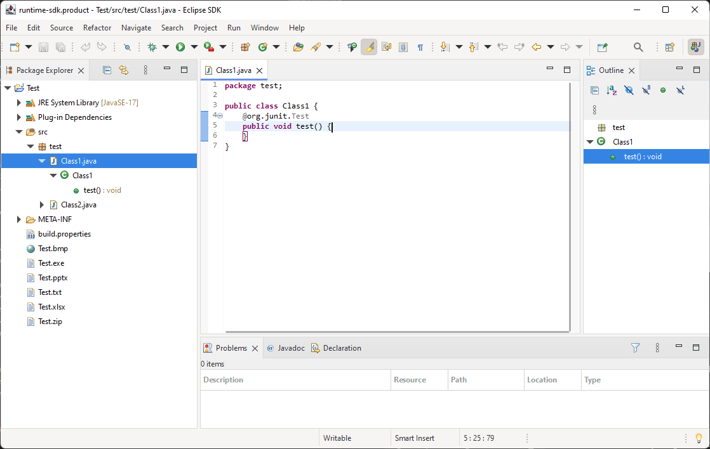
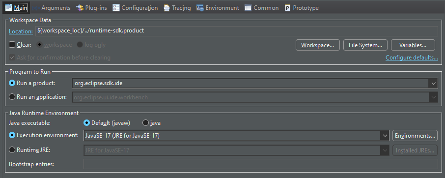
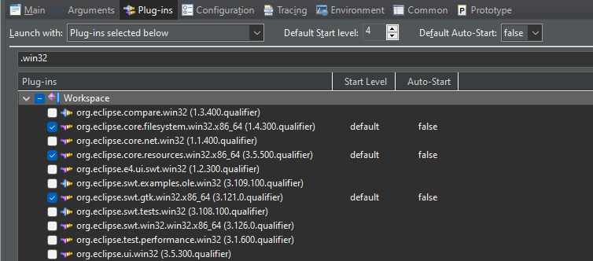

# Using SWT with GTK on Windows

This branch prototypes the usage of GTK for rendering SWT on Windows. It is based on work done some years ago: https://bugs.eclipse.org/bugs/show_bug.cgi?id=488431



## Installing GTK on Windows

To provide GTK on Windows, you best follow the official GTK documentation: https://www.gtk.org/docs/installations/windows

The tests I have made based on this branch are using the MSYS2-based setup of GTK, which works fine.

1. Install MSYS2: https://msys2.github.io/
2. Update MSYS2:
     ``` 
     pacman -Syuu
     ``` 
3. Install GTK 3/4 via the MSYS shell:
      ```
      pacman -S mingw-w64-x86_64-gtk3
      pacman -S mingw-w64-x86_64-gtk4
      ```
4. Add the libraries installed via MSYS to your `PATH`. E.g., when using the default MSYS installation directory `C:\msys64`, the `PATH` entry should be: `C:\msys64\mingw64\bin`
5. _Optional:_ If you want to or need to compile the SWT binaries, you should istall:
      ```
      pacman -S mingw-w64-x86_64-toolchain
      ```
  
## Using GTK on Windows
For GTK on Windows, there is a new SWT fragment project in the `binaries` folder: `org.eclipse.swt.gtk.win32.x86_64`. Be aware that it is currently integrated via some tweaks, e.g., the misuse of the specified window system to ensure that GTK fragment is used on Windows even though a Win32 window system is present and to _not_ use the original Windows fragment.

Steps to use:
* Have an ordinary Eclipse SDK workspace with SWT.
* Checkout this branch and, if necessary, rebase it onto your used SWT state.
* Import the `org.eclipse.swt.gtk.win32.x86_64` fragment into your Eclipse workspace.
* In case you do not use the state of SWT as provided in the `gtk-on-windows` branch, you need to generate the binaries (see below).
* Start some product (for example the `org.eclipse.sdk.ide` product) using SWT and make sure that your launch configuration uses the GTK instead of the Win32 SWT fragment and that the Win32-specific UI fragments are not enabled.
  * The following should _not_ be enabled:
    * `org.eclipse.swt.win32.win32.x86_64`
    * `org.eclipse.compare.win32`
    * `org.eclipse.e4.ui.swt.win32`
    * `org.eclipse.ui.win32`
  * The following should be enabled instead:
    * `org.eclipse.swt.gtk.win32.x86_64`






### Building the binaries
* Start a Maven build for the SWT repository by calling `mvn clean compile` in the root folder. This will currently not succeeds but will at least generate some metadata for the binaries generation.
* Run the following command in the `binares/org.eclipse.swt.gtk.win32.x86_64` folder:
  ```
  mvn clean process-resources -Dnative=gtk.win32.x86_64 -Dws=gtk -Dos=win32 -Darch=x86_64 -DskipTests
  ``` 
  
  This should generate the binaries, i.e, in the `build-native-binaries` phase, it should execute the batch script running the C++ compiler and the copy the generated *.dll files to the project folder.

Note that this currently only builds GTK3 binaries and does not allow to use GTK4 yet. However, it's only because the latter has not been tried out and might be easy to achieve.


## Limitations and Workarounds

Some limitations of the GTK on Windows usage for SWT have been documented in the original issue: https://bugs.eclipse.org/bugs/show_bug.cgi?id=488431

There are two further tweaks currently applied in this branch:
* Images used by TreeItems are not accessed properly. They are stored in an image map of the item's Tree, but not retrieved properly. In this branch, a patch is applied that simply stored the proper image surface within each TreeItem.
* A specific shell constructor is currently not working, making the splash screen creation fail. In this branch, a patch is applied that simply creates a new shell for the splash instead of used a passed handle.

When using SWT with the Eclipse Platform, note that the Win32-specific bundles can currently not be used and have to be removed from launch configurations:
* `org.eclipse.compare.win32`
* `org.eclipse.e4.ui.swt.win32`
* `org.eclipse.ui.win32`

They may need to or can be replaced by GTK-specific bundles, but no work has been done on that yet.
